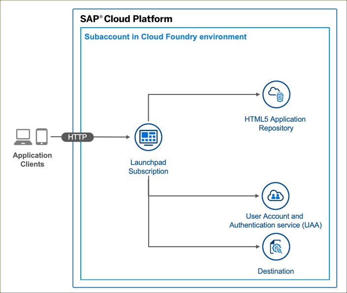
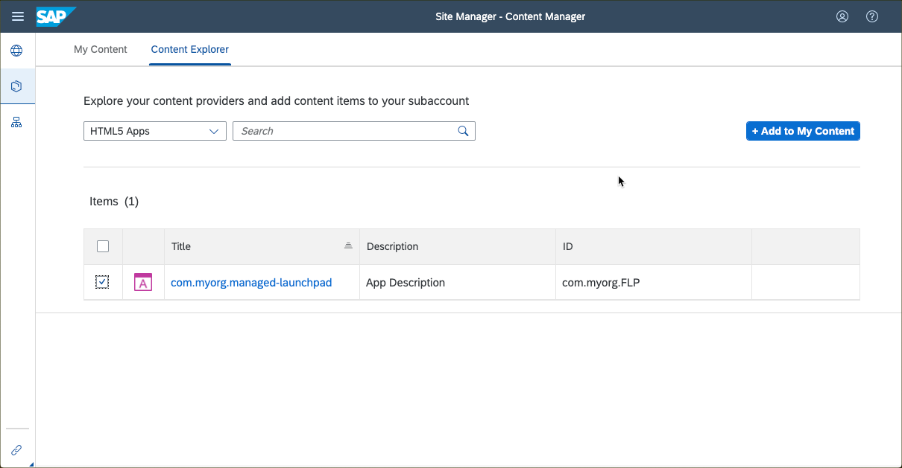
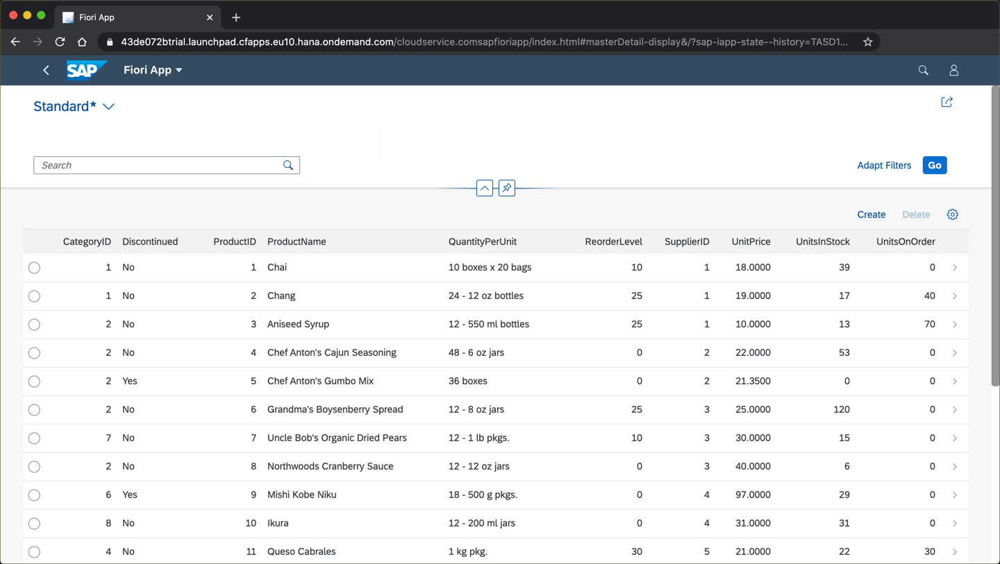

# SAP Fiori app on HTML5 Runtime Managed by SAP Cloud Platform

## Diagram




## Description

This is an example of an SAP Fiori app that is managed by SAP Cloud Platform. The SAP Fiori app is exposed to an SAP Cloud Platform Launchpad and is visible in the content manager of the launchpad. The app is deployed to the HTML5 Application Repository and uses the Authentication & Authorization service (XSUAA service) and the destination service. 

The web app that is contained in the `HTML5Module-content.zip` defines the following (minimum) properties in the `manifest.json` file.

```JSON
{
  "sap.cloud": {
    "public": true,
    "service": "cloud.service"
  },
  "sap.app": {
    "id": "com.myorg.FLP",
    "applicationVersion": {
      "version": "1.0.0"
    }
  },
  "sap.ui5": {
    "dependencies": {
        "minUI5Version": "1.65.0"
    }
  }
}
```

This app includes a Fiori Elements app generated by fiori-tools in the HTML5Module folder.

The app can be run at design-time with:
```
npm start
```

## How was it built
This app was built using the basic sap-provided [mta template](https://github.com/SAP-samples/multi-cloud-html5-apps-samples) and then replacing the included bare-bones fiori app with a fiori elements app generated with fiori-tools. There is no "tool" help to put a real fiori app inside this managed html runtime mta container yet so we have some fiddly manual steps as shown here:

1. git clone the [mta template](https://github.com/SAP-samples/multi-cloud-html5-apps-samples) repo and cd into the managed-html5-runtime-fiori-mta directory
1. code . to open vscode
1. Run the fiori-tool yeoman generator and generate a fiori elements app based on the northwind sample odata service (in vscode type F1 - then start typing "fiori" to find the fiori-tools application generator). *Do this in a different diretory*!
1. Copy the web app folder that was generated by the fiori-tools yeoman generator and paste it into the HTML5Module folder of our mta app
1. Move the xs-app.json file inside the webapp folder and adjust the welcomeFile property to point to the generated flpSandbox.html file (or any index.html file you create to launch the app)
1. Add "sap.cloud": { "service": "cloud.service" } to the top-level of the manifest.json file. This is required for the sap-managed html5 service
1. In the manifest.json dataSources section: remove the leading / from the mainService URL to make it relative. If I don't do this I get "bad gateway" errors on all odata calls
1. Add the crossNavigation - inbound section so that the Portal/Launchpad can create a tile for the app
1. Adjust the html file to use the sapui5 runtime from the CDN and not locally served (its faster during development to use UI5 locally so this would be a step you want to change just for deployment - may be able to do this with a custom ui5 build step)
1. Adjust the fiori apps descriptor (package.json) to zip the /dest folder for deployment by the html5 app deployer (described in the mta file) which is created by the UI5-tooling as follows.


## Requirements
- You have an SAP Cloud Platform trial account in the region Europe (Frankfurt). For creating the trial account, see this [tutorial](https://developers.sap.com/tutorials/hcp-create-trial-account.html).
- Node.js LTS version 10 is installed: <https://nodejs.org/en/download>
- Cloud Foundry Command Line tool (cf CLI)  is installed. For more information, see this [tutorial](https://developers.sap.com/tutorials/cp-cf-download-cli.html)
- The Multi-Target Application Cloud Foundry CLI [Plugin](https://github.com/cloudfoundry-incubator/multiapps-cli-plugin) (MultiApps CF CLI Plugin) is installed : 
    ```
    cf add-plugin-repo CF-Community https://plugins.cloudfoundry.org
    cf install-plugin multiapps
    ```
- GNU Make : <https://www.gnu.org/software/make>

    If you are running macOS or Linux it's likely that you already have Make installed. As a Windows user, please use the [Chocolatey](https://chocolatey.org/) package manager to install [Make](https://chocolatey.org/packages/make) via `choco install make`. After the installation, please check you can start the executable (`make`) from the terminal.

## Download and Deployment
1. Subscribe to the [launchpad service](https://developers.sap.com/tutorials/cp-portal-cloud-foundry-getting-started.html) if you haven't done so before.
1. Download the source code:
    ```
    git clone https://github.com/SAP-samples/multi-cloud-html5-apps-samples
    cd multi-cloud-html5-apps-samples/managed-html5-runtime-fiori-mta
    ```
2. Build the project:
    ```
    npm install
    npm run build
    ```
3. Deploy the project:
    ```
    npm run deploy:cf
    ```
    or
    ```
    cf deploy mta_archives/managed_fiori_1.0.0.mtar
    ```
4. Or build and deploy in one step:
    ```
    npm run deploy
    ```

*Note: Be careful that you do not already have a manually created destination with the same name that is dynamically created from the mta.yaml. If you do it will raise deploy with the destination service. This sample app uses a destination named `Northwind`*

If the deployment has been successful, you will be able to form the URL of the app based on the URL of launchpad. It will have the following structure: <https://[globalaccount-id].launchpad.cfapps.[region].hana.ondemand.com/cloudservice.comsapfioriapp/index.html#Shell-home>

## Check the Result

### List the Deployed HTML5 Apps
```
$ cf html5-list                                     
Getting list of HTML5 applications in org 9f10ed8atrial / space dev as firstname.lastname@domain.com...
OK

name          version   app-host-id                            service instance                    visibility   last changed   
commyorgFLP   1.0.0     615b773a-e5f8-4f9b-b5c0-f082fe275364   managed_launchpad_html5_repo_host   public       Tue, 15 Sep 2020 13:44:55 GMT    
```

### List the Deployed MTA

```
$ cf mta hello-world
Showing health and status for multi-target app hello-world in org 9f10ed8atrial / space dev as firstname.lastname@domain.com...
OK
Version: 1.0.0

Apps:
name   requested state   instances   memory   disk   urls   

Services:
name                                service           plan          bound apps   last operation   
managed_launchpad_destination       destination       lite                       update succeeded   
managed_launchpad_html5_repo_host   html5-apps-repo   app-host                   update succeeded   
managed_launchpad_uaa               xsuaa             application                update succeeded  
```


### List the Deployed Content with the Content Explorer




### Check the HTML5 App

Access the URL to view the web app. You are redirected to a sign-on page before you can see the web app.


